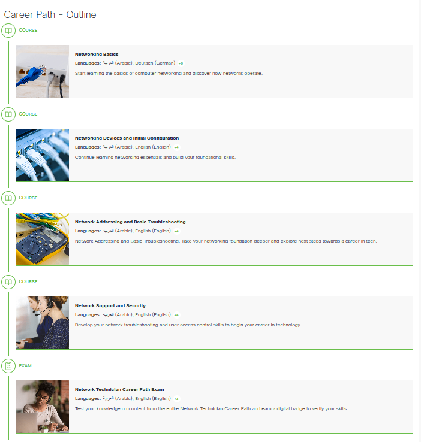

# Nätverksteknik - 23TEi - 25/26    

## Vecka 35 

Klassdag.

## Vecka 36   

### Måndag  

Uppstart av Nätverksteknik!  

Vi ska under läsåret följa Ciscos Network Technician Career Path:  

Som består av 4 delkurser.  

[Network Technician](https://www.netacad.com/career-paths/network-technician?courseLang=en-US)   

  

### Tisdag   

Vi fortsätter att arbeta med första delen av CCST Networking - Networking Basics.  

Genomgång av modul 2, 3 och 4. Nästa vecka kör vi prov på modul 1-4   

## Vecka 37   

### Måndag  

[Prov: Modul 1 - 4](netacad.com)

### Tisdag  

Genomgång av Modul 5,6 och 7 färdig.

## Vecka 38   

### Måndag  

Arbeta med Modul 5,6 och 7.

### Tisdag  

[Prov: Modul 5 - 7](netacad.com) 

## Vecka 39   

### Måndag  

### Tisdag  

## Vecka 40   

### Måndag  

### Tisdag  

## Vecka 41   

### Måndag  

### Tisdag  

## Vecka 42   

### Måndag  

### Tisdag  

## Vecka 43   

### Måndag  

### Tisdag  

## Vecka 44   

**HÖSTLOV**   

## Vecka 45   

## Vecka 46   

## Vecka 47   

## Vecka 48   

## Vecka 49   

## Vecka 50   

## Vecka 51   

## Vecka 52   

**VINTERLOV**   

## Vecka 2   

## Vecka 3   

## Vecka 4   

## Vecka 5   

## Vecka 6   

## Vecka 7   

**SPORTLOV**   

## Vecka 8   

## Vecka 9   

## Vecka 10   

## Vecka 11   

## Vecka 12   

## Vecka 13   

## Vecka 14   

**PÅSKLOV**   
## Vecka 15   

## Vecka 16   

## Vecka 17   

## Vecka 18   

## Vecka 19   

## Vecka 20   

## Vecka 21   

## Vecka 22   

## Vecka 23   

## Vecka 24   

## Vecka 25   
**SOMMARLOV**   

---     
 Detta dokument är licensierat under en [Creative Commons Erkännande-DelaLika 4.0 Internationell Licens](http://creativecommons.org/licenses/by-sa/4.0/).    
Bilder och fotografier tillhör respektive upphovsman, och befinner sig inte nödvändigtsvis under en Creative Commons-licens.
