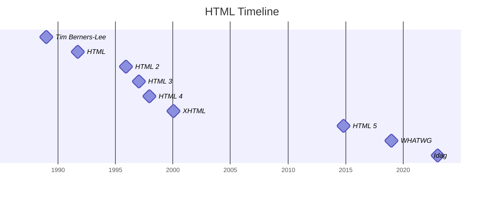

# Webbutveckling 1 - 21TEI

## Vecka 35

Uppstartsvecka!

#### Måndag
Kursplanering, presentation och introduktion till ämnet. Tittar på [Skolverkets riktlinjer](https://www.skolverket.se/undervisning/gymnasieskolan/laroplan-program-och-amnen-i-gymnasieskolan/gymnasieprogrammen/amne?url=1530314731%2Fsyllabuscw%2Fjsp%2Fsubject.htm%3FsubjectCode%3DWEU%26lang%3Dsv%26tos%3Dgy%26p%3Dp). 

*Upphovsrätt och Creative Commons.* Tar upp [Statute of Anne](https://en.wikipedia.org/wiki/Statute_of_Anne), [Gutenberg](https://en.wikipedia.org/wiki/Johannes_Gutenberg), [The Mickey Mouse Curve](https://techliberation.com/2009/08/06/copyright-duration-and-the-mickey-mouse-curve/), [The Disney History](https://www.boredpanda.com/funny-disney-history/), [Cory Doctorow](https://craphound.com/) och [Jonathan Coulton](https://www.jonathancoulton.com/). 

#### Tisdag
Fortsätter tala om Creative Commons. Tittar på klippet "[Vad är Creative Commons?](https://youtu.be/Yd9dP3vlOyk)" och ser exempel på sidor där man hittar verk under Creative commons-licenser, som "[Free SVG](https://freesvg.org/)", "[Free Music Archive](https://freemusicarchive.org/)" och "[Pexels](https://www.pexels.com/sv-se/)". Mer information finns på [Creative Commons egna webbplats](http://www.creativecommons.se/). 

Ett verk som är Creative Commons är "[Sintel](https://youtu.be/eRsGyueVLvQ)". 

Sintel är skapad med *Free och Open Source Software*. Vi ser klippet "[What is Open Source explained in LEGO](https://youtu.be/a8fHgx9mE5U)", och läser dokumentet "[How to become a hacker](https://d.cxcore.net/Eric%20S%20Raymond/How%20To%20Become%20A%20Hacker.pdf)". Det är en ruggigt bra idé att bidra till ett projekt, och här är ett tips "[How to find an Open Source project to contribute to](https://dev.to/this-is-learning/how-to-find-an-open-source-project-to-contribute-to-3093)".

## Vecka 36

Vad är webben? Relationen mellan Internet och the World Wide Web. Vad var syftet med WWW och hur hänger det syftet ihop med idealen som Free och Open Source Software och Hacker-kulturen har? Vikten av Fri mjukvara blir tydligt i exemplet med Karen Sandler som ni kan höra i talet "[Freedom in My Heart - Lessons from a Cyborg Lawyer](https://youtu.be/qW1h1s_ojpM)" eller läsa om i artikeln "[Why cyborgs need free software](https://superuser.openstack.org/articles/medical-devices-free-software/)". Sedan avrundar vi med lösenordsteori.

Vi ser dokumentären "[The web, past and future](https://youtu.be/cCE2EyV_IiY)" (35 min). 

Dagens uppgift är att skaffa konton i en del tjänster samt installera den webbläsare vi kommer använda i kursen. 

[Uppgift: Accounts and Software](https://tcstenungsund.github.io/schedule/assignment.html?link=assignments/weuweb01-accounts_and_software)

## Vecka 37 

#### Måndag

Dokumentären "The web, past and future" introducerade oss till Tim Berners-Lee och [W3C](https://en.wikipedia.org/wiki/World_Wide_Web_Consortium). Utifrån det talar vi om [http](https://en.wikipedia.org/wiki/Hypertext_Transfer_Protocol), [HTML](https://simple.wikipedia.org/wiki/HTML) och [CSS](https://en.wikipedia.org/wiki/CSS). Vi lär oss att HTML strukturerar upp information med taggar för att webbläsaren skall förstå. 

#### Tisdag

Hur är CSS strukturerat och hur använder man det? Några vanliga värden och egenskaper. CSS styr färg och position. Om HTML är till för webbläsaren så är CSS till för människor. 

[Uppgift: HTML & CSS Basics](https://tcstenungsund.github.io/schedule/assignment.html?link=assignments/weuweb01-html_css_basics)

## Vecka 38 

#### Måndag

Vi slutför uppgiften HTML & CSS Basics. 

#### Tisdag

Genomgång av [HTML Beginner](https://htmldog.com/guides/html/beginner/) och [CSS Beginner](https://htmldog.com/guides/css/beginner/). 

När du skall lägga till en bild måste du avgöra om den är en del av innehållet eller utseendet, för att kunna bestämma om den skall ligga som en IMG-tag i HTML eller som en background-image i CSS. 

[Uppgift: Min Fula Lilla Sida](https://tcstenungsund.github.io/schedule/assignment.html?link=assignments/weuweb01-min_fula_lilla_sida)

## Vecka 39

#### Måndag

Fortsätt arbeta med Min Fula Lilla Sida. 

#### Tisdag

###### Mått och färg
Utöver uppbyggnaden av CSS är det viktigt att förstå mått och färg. "[The Lengths of CSS ](https://css-tricks.com/the-lengths-of-css/)" ger oss måtten, och färgerna hittar vi på "[MDN: color](https://developer.mozilla.org/en-US/docs/Web/CSS/color)". Vi ser också "[What The Heck Is A Hex Value Anyway?](https://cgi.tutsplus.com/tutorials/what-the-heck-is-a-hex-value-anyway--ae-11932)" (4:15) och "[Are you using the right CSS units?](https://youtu.be/N5wpD9Ov_To)" (6:29).

Hur vi använder färger kan du förstå genom att titta på ett "[Color wheel](https://en.wikipedia.org/wiki/Color_wheel)" och "[The 60:30:10 design rule for web design](https://yuricodesbot.hashnode.dev/the-603010-color-rule-for-web-design)". Hitta nya kombinationer med hjälp av "[ColorKit](https://colorkit.co/)" och "[Color picker](https://htmlcolorcodes.com/color-picker/)".

###### The box model 
En av de absolut viktigaste momenten i kursen är att förstå "[the box model](https://developer.mozilla.org/en-US/docs/Learn/CSS/Building_blocks/The_box_model)". "[The box model for beginners](https://youtu.be/MrAnu4zdjjY)" (1:54)

*Läxa till vecka 40* Se följande två klipp och lämna sedan in två saker du lärde dig, en från vardera klippet. "[Read color hex codes](https://youtu.be/eqZqx6lRPe0)" (17:49) och "[Learn CSS Box Model In 8 Minutes](https://youtu.be/rIO5326FgPE)" (8:22).

## Vecka 40

#### Måndag 

Fortsätt arbeta med Min Fula Lilla Sida. 

###### Teckenkodning

* Undvik svenska tecken, åäö
* Undvik\_mellanslag\_
* Undvik STORA bokstäver

Vid all namngivning (filer, kataloger, etc) så gäller ovanstående grundregler. En av anledningarna till dessa är "[character encoding](https://developer.mozilla.org/en-US/docs/Glossary/character_encoding)". Idag förlitar vi oss på "[Unicode](https://youtu.be/2r6OZD5n-wc)" (3:01).

#### Tisdag 

Genomgång av [HTML Intermediate](https://htmldog.com/guides/html/intermediate/) och [CSS Intermediate](https://htmldog.com/guides/css/intermediate/).

Vi lär oss [semantisk HTML](https://en.wikipedia.org/wiki/Semantic_HTML), tittar på [HTML5 Sectioning flowchart](http://html5doctor.com/downloads/h5d-sectioning-flowchart.png) och läser "[8 HTML tags you need to be using (and 5 to avoid)](https://www.creativebloq.com/advice/html-tags)". 

)

###### Specificity
Ett av de absolut viktigaste momenten i kursen! Vi ser "[How CSS Specificity Is Calculated](https://youtu.be/ZBphodDntVc)" (4:53), läser "[MDN Specificity](https://developer.mozilla.org/en-US/docs/Web/CSS/Specificity)" och skrattar åt "[Batficity](http://batificity.com/)". 

## Vecka 41

#### Måndag 

Fortsätt arbeta med Min Fula Lilla Sida. 

###### Kontrast
"[Contrast Rebellion](https://contrastrebellion.com/)"*\** talar om för oss varför kontrast är viktigt, och på "[Color review](https://color.review/)" kan vi testa våra färger. (Läs mer och gör interaktiva övningar på "[Color & Contrast](https://colorandcontrast.com/)".)

#### Tisdag 

Layout modes 

## Vecka 42

#### Måndag 

Fortsätt arbeta med Min Fula Lilla Sida. 

#### Tisdag 

Genomgång av [HTML Advanced](https://htmldog.com/guides/html/advanced/) och [CSS Advanced](https://htmldog.com/guides/css/advanced/).

## Vecka 43

#### Måndag 

Fortsätt arbeta med Min Fula Lilla Sida. 

#### Tisdag 

Cascade. 

## Vecka 44

**HÖSTLOV**

## Vecka 45

Deadline för Min Fula Lilla Sida. 

## Vecka 46

Prov på HTML & CSS.

## Vecka 47

## Vecka 48

## Vecka 49

## Vecka 50

## Vecka 51

## Vecka 52

## Vecka 53

**VINTERLOV**

## Vecka 2

## Vecka 3

## Vecka 4

## Vecka 5

## Vecka 6

## Vecka 7

**SPORTLOV**

## Vecka 8

## Vecka 9

## Vecka 10

## Vecka 11

## Vecka 12

## Vecka 13

## Vecka 14

**PÅSKLOV**

## Vecka 15

## Vecka 16

## Vecka 17

## Vecka 18

## Vecka 19

## Vecka 20

## Vecka 21

## Vecka 22

## Vecka 23

## Vecka 24

**SOMMARLOV**
