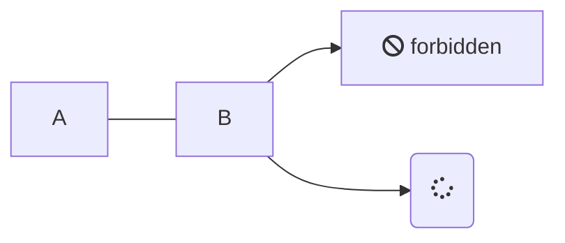

# Loggbok Webbutveckling 1 19TEi

## Vecka 36

Uppstartsvecka: Upphovsrätt, Free och Open Source Software och Creative Commons

## Vecka 37

Kursplanering, presentation och introduktion till ämnet

Nu är jag inbjuden i 19TEI-rummet, så vi kör där på Teams.

## Vecka 38

Genomgång av [HTMLdog HTML Beginner](https://htmldog.com/guides/html/beginner/). Vi diskuterade även UTF-8, [ISO 8601](https://m.xkcd.com/1179/) och andra nyttigheter.

Uppstart av projektet "[inlämning Min Fula Lilla Sida på riktigt](../assignment.html?link=min_fula_lilla_sida)".

Under detta första projekt, kom ihåg och iakta följande punkter för att undvika problem med filnamn:

*   Undvik svenska tecken, åäö
*   Undvik\_mellanslag\_
*   Undvik STORA bokstäver
*   Lägg alla filer i samma [Prov Min Fula Lilla Sida Webbprojekt!](../assignment.html?link=min_fula_lilla_sida)

## Vecka 39

Genomgång av [HTMLdog CSS Beginner](https://htmldog.com/guides/css/beginner/).

Vi tittade på [MDN Color picker](https://developer.mozilla.org/en-US/docs/Web/CSS/CSS_Colors/Color_picker_tool), såg klippet "[What the Heck Is A Hex Value Anyway](https://cgi.tutsplus.com/tutorials/what-the-heck-is-a-hex-value-anyway--ae-11932)" och talade om hur viktigt det är med "[kontrast](http://contrastrebellion.com/)" 🔹.

Fortsätt arbeta med "Min Fula Lilla Sida" och se till att ni testat och lekt med allt det som finns med i HTML Beginner och CSS Beginner.  

## Vecka 40

Repetition av HTML Beginner och CSS Beginner, framför allt the Box Model. Vi tittar även på hjälpmedel för att välja färger, som [Coolors](https://coolors.co/), [Picular](https://picular.co/), [Adobe Color](https://color.adobe.com/sv/create/color-wheel) och [Paletton](http://paletton.com/).

MDN är ett av de bästa referensverken (och [W3Fools](https://www.w3fools.com/) talar om för oss att undvika W3Schools).

Vi jobbar vidare med "Min Fula Lilla Sida".  

## Vecka 41

**\[DISTANS\]** – Join Microsoft Teams Meeting

Genomgång av HTMLdog HTML Intermediate och HTMLdog CSS Intermediate.

En titt på HTML5 Element Flowchart kan snabbt hjälpa dig att avgöra vilka av de nya taggarna du skall använda, när du försöker märka upp något i HTML.

Vi jobbar vidare med "Min Fula Lilla Sida".

## Vecka 42

Genomgång av HTMLdog CSS Intermediate.

Vi ser filmen "The Lowdown on CSS Positioning" som förklarar positionering för oss.

För att förstå Specificity i CSS, kan det hjälpa att se videon "Learn CSS Specificity" och även "Explaining CSS Specificity", de förklarar på två olika men tydliga sätt hur Specificity fungerar. Läs gärna artikeln MDN Specificity. Och slutligen, som ett hjälp för minnet, finns resursen Batificity. :-)

Läs om hur man felsöker CSS på MDN i artikeln Examine and edit CSS.

## Vecka 43

**\[DISTANS\]** Join Microsoft Teams Meeting

Genomgång av HTMLdog HTML Advanced och CSS Advanced.

Introduktion till CSS Grid och Flexbox. Vi ser även klippet "Flexbox vs. CSS Grid — Which is Better?" av Jen Simmons. Dessutom påbörjar vi Flexbox Froggy och CSS Grid Garden.

## Vecka 44

**HÖSTLOV**

## Vecka 45

Introduktion till CSS-ramverket Bootstrap.Presentation av editorerna Atom, Brackets och Visual Studio Code, samt några funderingar kring varför Dreamweaver, Eclipse och PHPStorm inte är så lämpliga val för våra behov.

## Vecka 46

**\[DISTANS\]**  Klicka här för att delta i mötet.

Repetition…

Läxa: Se första och andra videon i serien Bootstrap 4 Introduction.

## Vecka 47

Prov: Webbutveckling HT

## Vecka 48

**\[DISTANS\]**

Genomgång av provet.

Vi ser "How to Design a Logo", "Inkscape Explained: Basix Keyboard & Mouse Functions" och "Skyline Logo Tutorial".

För en mer ingående förståelse av Inkscape, se videoserien "Inkscape Explained". För inspiration, se både de videos som Nick Saporito lagt upp, och även tutorials från HeathenX.

Vi börjar med uppgiften “Vektorgrafik - Personligt varumärke”.

Deadline: "Min Fula Lilla Sida" (Söndag, 23:59)

## Vecka 49

Vektorgrafik

Deadline: "Vektorgrafik - Personligt varumärke" (Söndag, 23:59)

## Vecka 50

**\[DISTANS\]**

Planeringsverktyg

Vi tittar på samarbetsverktyg som Comp\*/Mockup, StyleTile 🔹, "Style Tiles and How They Work", "Introduction to Style Tiles for Web Design" och "How to create a pattern library and why you should bother".

Allt detta är en del av den dokumentation man skall göra för en webbsida. Ibland används ord som grafisk profil, pattern library eller style guide. "Creating Style Guides" 🔹

## Vecka 51

**\[DISTANS\]**

Planeringsverktyg – Wireframes och Moodboards

Vi ser "How to wireframe a website", "Wireframing for UX - What it is and how to get better at it", "The 7 wonders of wireframes"\* och "What is a Wireframe?".

Vi gör labben “Planeringsverktyg – Wireframes”.

"How moodboards can save time, money and your sanity!" 🔹, "Generating web design moodboards through collaboration" 🔹, "How To Make A Mood Board".

## Vecka 52

**\[DISTANS\]**  Click here to join the meeting

Terminssammanfattning.

Se videoklippet “Where do Browser Styles Come from?” (7 min) och leta sedan upp ett CSS Reset-dokument på webben och läs in dig på det så du får ett hum om hur det fungerar. Guldstjärna om det är ett som ingen annan valt.

Se videoklippet “Build a Classic Layout FAST in CSS Grid” (8:30 min) och fundera på hur din “Min Fula Lilla Sida” hade sett ut om du då kunnat det du nu lärde dig i videoklippet? Experimentera gärna med egen kod för att testa.

Gör sedan klart alla uppgifter du har efter dig, och LÄMNA IN UPPGIFTERNA!  De som inte har lämnat in alla uppgifter när vårterminen börjar kommer att få F i det momentet, och riskerar att inte klara kursen.

## Vecka 53 - 1

**VINTERLOV**

## Vecka 2

**\[DISTANS\]**  Click here to join the meeting

Välkommen till vårens lektioner!

Flera av er riskerar att inte klara kursen, då ni inte lämnat in alla uppgifterna vi haft hitills. Snälla, åtgärda det så snabbt som möjligt! Det finns massor av instruktioner och hjälp här på It’s.

Idag är det TÄVLING! :-)

CSS Zen Garden 2021

## Vecka 3

**\[DISTANS\]**   Click here to join the meeting

Vi kör omröstning i förra veckans tävling!

Nytt moment! Vårprojektet. Gruppindelning.  Detta är ett grupprojekt! Men ni bedöms individuellt. Ni kommer också få ägna er at peer review, där ni bedömmer varandras insatser.

## Vecka 4

**\[DISTANS\]** Click here to join the meeting

Nu börjar vi med Vårprojektet!

Hitta på ett IT-relaterat tema ni tycker låter bra. "Datorvirusens historia!", "Hur man konstruerar en CPU", "Gör din dator säkrare!", “Vad är skillnaden mellan HTML och CSS?”, "Hur bygger man en egen dator?" eller "Trender i färglada tangentbord". Detta temat är starkt knutet till vad vi kallar “bussiness objective”.

Sedan tar ni fram 3-4 tydliga call to actions. Dessa använder ni sedan för att bygga upp undersidor. Skapa också en undersida som heter “Om oss”, där ni presenterar er och förklarar att detta är ett projekt ni gör i Webbutveckling 1. Nu har ni en webbplats med ett tydligt tema, och undersidor med klara målsättningar.

Istället för att skriva en massa text själva, använder ni nu material från Wikipedia för att fylla ut sidorna lagom mycket. Kom ihåg att det är tråkigt att läsa mycket text på nätet.

Ni skall skriva all HTML och CSS själva, och bygga den på ramverket Bootstrap.

## Vecka 5

\[UTGÅR\] Slutprov i IoT med RJO på plats på skolan.

## Vecka 6

**\[DISTANS\]**   Click here to join the meeting

Vi fortsätter med Vårprojektet.

## Vecka 7

**SPORTLOV**

## Vecka 8

**\[DISTANS\]**   Click here to join the meeting

Vi fortsätter med Vårprojektet.

Lyssna till avsnittet ”001 The Box-model” (12 min) av podcasten “The CSS Podcast”. (Finns också på Spotfy.)

## Vecka 9

**\[DISTANS\]**   Click here to join the meeting

Vi fortsätter med Vårprojektet.

Lyssna på avsnittet ”002 Selectors” (15 min) av podcasten “The CSS Podcast”. (Finns också på Spotify.)

## Vecka 10

**\[DISTANS\]** Click here to join the meeting

Genomgång av artikeln "The 30 CSS Selectors You Must Memorise"\*.

Vi fortsätter med Vårprojektet.

Lyssna på avsnittet ”003 Specificity” (13 min) av podcasten “The CSS Podcast”. (Finns också på Spotify.)

## Vecka 11

**\[DISTANS\]**  Click here to join the meeting

En repetition av artikeln "The 30 CSS Selectors You Must Memorise" i form av en CSS Selector-tävling.

Vi fortsätter med Vårprojektet.

Lyssna på avsnittet ”004 The Cascade” (12 min) av podcasten “The CSS Podcast”. (Finns också på Spotify.)

## Vecka 12

**\[DISTANS\]**   Click here to join the meeting

Vi fortsätter med Vårprojektet.

Under dagens lektion är några av er schemalagda för Utvecklingssamtal, se till att ni är tillgängliga på Teams vid er utsatta tid. Om någon behöver hjälp, fråga de andra grupperna, eller Ante. Det går också att skriva i grupprummet på Teams, så svarar Kenneth när tid finnes.

Lyssna på avsnittet ”005 Inheritance” (8 min) av podcasten “The CSS Podcast”. (Finns också på Spotify.)

## Vecka 13

**\[DISTANS\]** Click here to join the meeting

Vi fortsätter med Vårprojektet.

Under dagens lektion är några av er schemalagda för Utvecklingssamtal, se till att ni är tillgängliga på Teams vid er utsatta tid. Om någon behöver hjälp, fråga de andra grupperna, eller Ante. Det går också att skriva i grupprummet på Teams, så svarar Kenneth när tid finnes.

Repetera avsnitt 1 – 5 av “The CSS Podcast”.

## Vecka 14

**PÅSKLOV**

## Vecka 15

**\[DISTANS\]** Click here to join the meeting

Föreläsning: Användartester, eller Usability testing.

Det finns ett helt gäng artiklar i ämnet: "Usability Testing: Don't Guess, Test."_, "How to run live user testing", "What goes into a user testing script", "Testing design: How do you test a design comp?"_

Vi fortsätter med Vårprojektet.

Test: The CSS Podcast avsnitt 1 – 5.

## Vecka 16

**\[DISTANS\]**   Click here to join the meeting

Föreläsning: "Web Content Accessibility Guidelines", och eboken "Digital tillgänglighet - Introduktion till WCAG" av Per Axbom.  

Genomgång av testet från vecka 15.

Vi fortsätter med Vårprojektet.

## Vecka 17

**\[DISTANS\]**   Click here to join the meeting

Läs artikeln “Building the Woke Web: Web Accessibility, Inclusion & Social Justice”.

Vi fortsätter med Vårprojektet.

## Vecka 18

**\[DISTANS\]**   Click here to join the meeting

På An Event Apart 2013 höll Jeffrey Zeldman föreläsningen "Ten Commandments of Web Design". Luke Wroblewski var där och tog anteckningar\*.

Vi fortsätter med Vårprojektet.

## Vecka 19

**\[DISTANS\]** Klicka här för att delta i mötet.

Vi avslutar Vårprojektet.

2021-05-12 Prov  Onsdag

2021-05-16 Deadline för Vårprojektet

## Vecka 20

**Studiedag**

## Vecka 21

Presentation av Vårprojektet.

Berätta om ert projekt. Vad målsättningen var, hur arbetet gick och vad resultatet blev. Visa den färdiga sidan, demonstrera funktionaliteten. Visa koden, och nämn några detaljer om hur den fungerar. Visa dokumentationen, och beskriv utvecklingsprocessen.

Ni väljer själva om ni vill göra en presentation, eller om ni använder dokumentationen som illustrationsmaterial. Se till att alla i gruppen är delaktiga.

Utvärdering av Vårprojektet.

## Vecka 22

Genomgång av provet.

Kursutvärdering.

## Vecka 23

Resurslektion

Till hösten börjar Webbutveckling 2. Där krävs det att ni är duktiga på CSS och Bootstrap. Så om ni inte känner er väldigt säkra på de två momenten, så rekommenderar jag att ni repeterar lite i sommar. Här är några resurser som kan hjälpa er.

7 Important Tips for Writing Better CSS

Use CSS to solve common problems

Firefox DevTools for CSS authors

14 Firefox Developer Tools You Might Not Know About

20 Useful CSS Tips For Beginners

Learn Bootstrap Fast With These 10 Helpful Tips

How to Setup and Use Bootstrap (Step-by-Step)

I materialet ovan kommer ni stöta på begrepp som JavaScript, LESS, SASS, Gulp och Grunt, men det är sådant vi kommer att titta på längre fram i kommande kurser. Prioritera att bli duktiga på CSS och Bootstrap just nu!

## Vecka 24

**SOMMARLOV**

